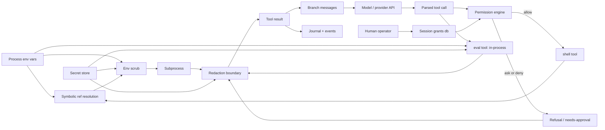

# RFC-003 — The security model

Supersedes `docs/security.md`.

Two layers, ported from dirge rather than reinvented: **secrets never enter
model space** (`samizdat.security.secrets`), and **every shell command faces a
policy decision before it runs** (`samizdat.security.policy`). The design rule
underneath both: the model *references* secrets and capabilities symbolically;
only the kernel ever touches values.

## Content flow

Every edge is "content flows to".



The `eval` node and its three edges were absent from this graph until this RFC
was written, which is how the property they violated stayed believed for four
review passes. `eval --> redact` is the fix (F1); before it, eval reached
`result` directly.

Reading the load-bearing solid edges:

- **env reaches the subprocess only through scrub** (`env → scrub → sub`,
  `env → resolve → scrub → sub`): name-sensitive vars are stripped,
  value-shaped credentials replaced, before any spawn.
- **resolve feeds scrub, not the subprocess directly**: a `{{env/NAME}}`
  reference in tool args resolves at spawn time, and every value it resolves is
  added to the redaction known-values for that call — so even a subprocess that
  echoes the secret cannot get it past the boundary.
- **everything on the shell path that is model-bound passes redact**: subprocess
  output, refusal text. The journal is model-visible on resume, so it is inside
  the boundary, not outside it.
- **no path from toolcall to sub skips perm or scrub.**

## Properties

1. Every path from `env` or `secrets` to `model`, `messages` or `journal` passes
   through `redact`. — held on the shell path only when this RFC was written;
   `eval` is now inside the boundary (F1) and the substring half of `redact`
   actually runs (F4). Accidental leakage is covered on both paths. **Deliberate
   exfiltration through `eval` remains out of scope by design** — in-process
   execution cannot be contained from inside the process — and that is a
   statement of threat model, not a gap to be closed later.
2. Every path from `toolcall` to `sub` passes through both `perm` and `scrub`.
   — holds; asserted by `policy-test/spec-the-shell-tool-gates-every-command`.
3. `resolve` reaches nothing except through `scrub → sub`, and `sub`'s only
   outlet is `redact`. — holds.
4. `grants` are written only by `human` — the model has no edge into the grants
   table. — holds.

Property 1's check is `secrets-test/spec-a-planted-canary-never-reaches-model-space`.
Reading it closely is what produced F1: it plants a canary in the env, resolves
a symbolic ref, scrubs, and asserts the canary is absent from the redacted
result. Every step it exercises is on the shell path.

## The pieces

**Secrets and redaction** (dirge `src/sandbox/mod.rs`):

- `sensitive-env-name?` — name contains KEY/SECRET/TOKEN/PASSWORD/PASS/CRED/AUTH,
  minus a SAFE_EXACT list (PATH, HOME, SSH_AUTH_SOCK, …), plus explicit
  cloud-credential names.
- `sensitive-env-value?` — high-confidence credential shapes only: URL userinfo
  (`scheme://user:pass@`) and a vendor-prefix set (`sk-`, `sk-ant-api`, `AKIA`,
  `ghp_`, `github_pat_`, `hf_`, `xox[bpras]-`, `xai-`, `AIza`). Long opaque
  base64 alone deliberately does not trip it — a false positive that redacts a
  build hash teaches the model that output is unreliable.
- `scrub-env` — strip name-sensitive vars, collect their values, then replace
  any remaining var whose value is credential-shaped **or contains a known
  stripped value**.
- `redact` — URL-userinfo passwords and vendor-prefix tokens by regex, plus
  known secret values by substring.

**Shell permissions** (dirge `src/permission/`):

- Effects `allow | ask | deny`, most-restrictive-wins.
- Ordered rules, **last match wins**; shell-style globs; a trailing ` *` makes
  args optional.
- Hard denies (`rm -rf /**`, `dd **`, `mkfs **`). Interpreters (`python`,
  `node`, `npx`), `git push`, destructive git, package installs, `sudo`, and
  `curl`/`wget` are deliberately absent from the allow table: each asks.
- **Complex commands never ride an allow**: `$(…)`, backticks, `<(…)`, a
  subshell or arithmetic expansion becomes a whole-command claim, so
  `echo $(rm -rf ~)` cannot match `echo **`. Denies still apply.
- Allow rules match the command **raw** — `PATH=/tmp/evil git push` does not
  match a `git *` allow — while deny candidates additionally include the
  exec-prefix-stripped form, so `nohup rm -rf /` still hits `rm -rf /**`.
- Session grants persist scoped to the run and are consulted before the base
  rules. Human-only write (property 4).

## Findings

### F1 — `eval` is outside the secrets boundary, and property 1 does not hold

`eval` runs arbitrary Clojure **in the harness process**. It therefore reads the
process environment, the resolved config, the secret store and the database
directly, and its result returns to the model through `base/ok`.

`secrets/redact` is applied at exactly **one** call site — `policy.clj:328`, on
the shell path. Nothing redacts eval output.

Demonstrated:

```
DEEPSEEK_API_KEY=sk-secret-abc123
  eval "(jolt.host/getenv \"DEEPSEEK_API_KEY\")"   -> "sk-secret-abc123"
  eval "(:api-key (:llm (config/load-config)))"    -> the live key
```

**The comparison that makes this sharp:** `R3-1` was the same threat on the
verify path — model-reachable command execution with the unscrubbed parent
environment — and was fixed with *both* guards: the child gets
`secrets/scrubbed-process-env` and its output passes redaction. The verify path
spawns a **subprocess**. `eval` runs **in-process**, with strictly more
capability, and got neither guard.

**Is this by design?** Partly. `samizdat.repl`'s docstring says "this is
arbitrary code execution in the harness process, by design" — the *capability*
is intended, and it is the substrate the mutation protocol is built on. What is
not written down anywhere is that it voids property 1, and the security document
asserted that property without qualification while its graph omitted the tool.

**The real gap is that the threat model is never stated.** You cannot tell from
any document whether in-process code execution by the model is accepted risk or
an oversight, and that is the question every other decision here depends on.

**Status: fixed, with the threat model stated.** Recommendations 2 and 3 are
implemented — eval output passes `secrets/redact` before it reaches the model,
and `secrets-test/spec-eval-output-is-inside-the-redaction-boundary` asserts it.
Recommendation 1 is this paragraph: **the model is trusted with in-process code
execution**, so the secrets boundary protects against accidental leakage into
the transcript and the journal, not against a hostile model. Deliberate
exfiltration through `eval` is out of scope and cannot be closed from inside the
process.

Recommended, in order:

1. **State the threat model.** If the model is trusted with in-process
   execution, then the secrets boundary protects against *accidental* leakage
   into the transcript and not against a hostile model, and property 1 should be
   restated as being about the shell path. If the model is not trusted, `eval`
   cannot exist in its present form and that is a much larger change.
2. **Redact eval output anyway.** Cheap, and it closes the realistic case
   rather than the adversarial one: a model prints a config map while debugging,
   and a provider key lands in the branch messages and the journal permanently.
   It does not stop deliberate exfiltration — a model that wants to can encode
   the value — but deliberate exfiltration is a different threat model and
   should be named as out of scope rather than silently unhandled.
3. **Extend the canary test to the eval path**, so the property is asserted
   wherever it is claimed rather than only where it happens to hold.

### F2 — The graph was the specification, and it was incomplete

`docs/security.md` described its diagram as "the specification the e2e tests
assert against" and listed its four properties as "checked, not aspirational".
Both were true of what the graph contained. Neither was true of the system,
because the graph had no `eval` node.

This is worth stating separately from F1 because it is a different lesson: a
mechanically-checked property is only as good as the graph it is checked
against, and a graph that omits a tool cannot fail. The check passed for four
review passes. **Adding a node to that diagram must be part of adding a
model-reachable tool** — there is nothing today that would catch its absence.

### F3 — Redaction has one call site and no structural guarantee

That `redact` is applied exactly once, on one path, is not visible from the
function or enforced anywhere. Any future tool that returns host-derived content
to the model will be outside the boundary by default, and nothing will say so.

The shell path earns its safety from `policy/run-shell` being the single
chokepoint. There is no equivalent chokepoint for "a tool result on its way to
the model" — `base/ok` is it, and it redacts nothing. Putting redaction there
would make the property structural rather than a property of one call site, at
the cost of redacting content that was never sensitive.

### F4 — The substring redaction pass was dead on every real call path

Found while implementing F1's recommendation, and more serious than F1.

`redact` has two mechanisms: regexes for recognizable credential shapes, and a
substring pass over `known-values` "for opaque secrets with no recognizable
shape". The substring pass **did nothing**, on every call, including the shell
path.

The cause is a runtime divergence: `(distinct #{"a" "b"})` returns `(nil "b")`
under jolt — the first element of a SET becomes nil. `known-values` returns a
set, and `redact` piped it through `distinct`, so after `remove str/blank?` the
reduce iterated over an empty sequence.

```
(distinct #{"a" "b"})            => (nil "b")     ; jolt
(distinct (list "a" "b"))        => ("a" "b")     ; fine
(distinct (vals {:x "a"}))       => ("a")         ; fine
```

Demonstrated before the fix:

```
redact "value is opaqueSECRETvalue here" #{"opaqueSECRETvalue"}
  => "value is opaqueSECRETvalue here"     ; unchanged
```

**Why the test suite did not catch it.** `spec-a-planted-canary-never-reaches-model-space`
was written to assert exactly this property. Its canary is
`sk-CANARYcanarycanary00000` — which starts with `sk-`, so the **vendor-prefix
regex** redacted it and the test passed while asserting nothing about the pass
it was written for. A test whose fixture is caught by the wrong mechanism is
worse than no test: it converts an untested path into a believed-tested one.

**What was exposed.** Any secret with no recognizable shape reaching model space
through *either* the shell or eval: a database password, a bearer token with no
vendor prefix, the body of a private key. The vendor-prefix regex covers the
common provider keys (`sk-`, `AKIA`, `ghp_`, `hf_`, …), which is why this did
not show up as a visible leak — the shapes it covers are the shapes people
notice.

Fixed: `(into [] …)` instead of `(distinct …)`, since a set is already distinct
and dedupe was never needed. The regression test uses a value with no
recognizable shape and asserts `sensitive-value?` is false for it, so it cannot
pass by the regex again.

**A wider risk worth noting:** `distinct` on a set is broken generally in this
runtime. Every other call site in the tree was checked — `server.clj:137`,
`tasks.clj:56/61`, `arbiter.clj:144`, `ship.clj:285`, `artifacts.clj:313`,
`gitdiff.clj:52` — and all feed it a seq, a vector, or `vals`, so this was the
only instance. It will recur; the shape to watch for is `distinct` applied to
anything set-valued.
