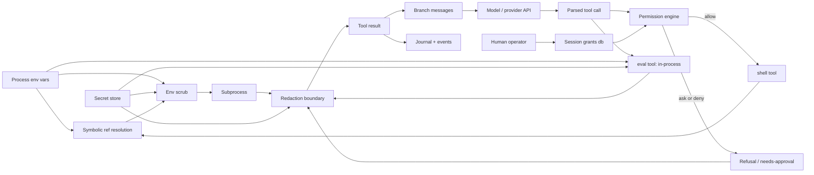

# RFC-003 — The security model

**Status:** implemented.

## Purpose

Specifies what contains the model, what deliberately does not, and the threat
model that makes that distinction coherent.

## Scope

**This layer decides** whether a command may run, and what a result may contain
by the time the model sees it.

**It must not decide** what to run. The permission engine is consulted; it does
not choose.

**It hands** an `allow`/`ask`/`deny` verdict to the shell tool, and redacted text
to whoever is returning a result.

### Threat model

**The model is trusted with in-process code execution.** `eval` runs arbitrary
Clojure in the harness process, and that is deliberate — it is the substrate the
mutation protocol is built on (RFC-002).

So the secrets boundary protects against **accidental** leakage into the
transcript and the journal: a model prints a config map while debugging and a
provider key lands in the branch messages permanently. It does **not** protect
against a hostile model, because in-process execution cannot be contained from
inside the process. A model that wants a value out can encode it.

That limit is a statement of scope, not a gap to be closed later. Everything
below should be read against it.

## Model

Two layers, ported from dirge rather than reinvented: **secrets never enter
model space** (`samizdat.security.secrets`), and **every shell command faces a
policy decision before it runs** (`samizdat.security.policy`). The design rule
underneath both: the model *references* secrets and capabilities symbolically;
only the kernel ever touches values.

## Protocol

### Content flow

Every edge is "content flows to".

The `eval` node and its three edges were absent from this graph until this RFC
was written, which is how the property they violated stayed believed for four
review passes. `eval --> redact` is the fix (F1); before it, eval reached
`result` directly.

Reading the load-bearing solid edges:

- **env reaches the subprocess only through scrub** (`env → scrub → sub`,
  `env → resolve → scrub → sub`): name-sensitive vars are stripped,
  value-shaped credentials replaced, before any spawn.
- **resolve feeds scrub, not the subprocess directly**: a `{{env/NAME}}`
  reference in tool args resolves at spawn time, and every value it resolves is
  added to the redaction known-values for that call — so even a subprocess that
  echoes the secret cannot get it past the boundary.
- **everything on the shell path that is model-bound passes redact**: subprocess
  output, refusal text. The journal is model-visible on resume, so it is inside
  the boundary, not outside it.
- **no path from toolcall to sub skips perm or scrub.**

## API

### `samizdat.security.secrets`

| fn | contract |
|---|---|
| `(sensitive-name? n)` | Whether an env var name is credential-shaped. |
| `(sensitive-value? v)` | Whether a value is a **high-confidence** credential shape. Long opaque base64 alone deliberately does not trip it: a false positive that redacts a build hash teaches the model that output is unreliable. |
| `(scrub-env env)` | The child environment: name-sensitive vars stripped, then any remaining var whose value is credential-shaped **or contains a stripped value** replaced. |
| `(scrubbed-process-env)` | `scrub-env` over the real environment. |
| `(stripped-values env)` | The values a scrub removed — what a subprocess could echo. |
| `(resolve-refs command env)` | `{{env/NAME}}` → the value, at spawn time. |
| `(refs-used command env)` | The values a command's refs resolved to. |
| `(known-values env [command])` | Everything this call must redact: stripped values ∪ resolved refs. **Returns a set.** |
| `(redact text [known-values])` | URL-userinfo and vendor-prefix tokens by regex, plus every known value by substring. Returns the text unchanged when nothing matched. |

### `samizdat.security.policy`

| fn | contract |
|---|---|
| `(decide command grants)` | `:allow`, `:ask` or `:deny` with the matching rule. |
| `(run-shell ctx command)` | **The chokepoint.** Permission, symbolic-ref resolution, scrubbed spawn, redacted output — the one place perm, scrub and redact meet. |

`(config/redacted m)` redacts a config map for the HTTP surface.

## Rule tables

**Secrets and redaction** (dirge `src/sandbox/mod.rs`):

- `sensitive-env-name?` — name contains KEY/SECRET/TOKEN/PASSWORD/PASS/CRED/AUTH,
  minus a SAFE_EXACT list (PATH, HOME, SSH_AUTH_SOCK, …), plus explicit
  cloud-credential names.
- `sensitive-env-value?` — high-confidence credential shapes only: URL userinfo
  (`scheme://user:pass@`) and a vendor-prefix set (`sk-`, `sk-ant-api`, `AKIA`,
  `ghp_`, `github_pat_`, `hf_`, `xox[bpras]-`, `xai-`, `AIza`). Long opaque
  base64 alone deliberately does not trip it — a false positive that redacts a
  build hash teaches the model that output is unreliable.
- `scrub-env` — strip name-sensitive vars, collect their values, then replace
  any remaining var whose value is credential-shaped **or contains a known
  stripped value**.
- `redact` — URL-userinfo passwords and vendor-prefix tokens by regex, plus
  known secret values by substring.

**Shell permissions** (dirge `src/permission/`):

- Effects `allow | ask | deny`, most-restrictive-wins.
- Ordered rules, **last match wins**; shell-style globs; a trailing ` *` makes
  args optional.
- Hard denies (`rm -rf /**`, `dd **`, `mkfs **`). Interpreters (`python`,
  `node`, `npx`), `git push`, destructive git, package installs, `sudo`, and
  `curl`/`wget` are deliberately absent from the allow table: each asks.
- **Complex commands never ride an allow**: `$(…)`, backticks, `<(…)`, a
  subshell or arithmetic expansion becomes a whole-command claim, so
  `echo $(rm -rf ~)` cannot match `echo **`. Denies still apply.
- Allow rules match the command **raw** — `PATH=/tmp/evil git push` does not
  match a `git *` allow — while deny candidates additionally include the
  exec-prefix-stripped form, so `nohup rm -rf /` still hits `rm -rf /**`.
- Session grants persist scoped to the run and are consulted before the base
  rules. Human-only write (property 4).

## Invariants

| # | invariant | enforced by |
|---|---|---|
| 1 | Every path from `env` or `secrets` to `model`, `messages` or `journal` passes through `redact`. | `policy/run-shell` on the shell path, and the `scrubbed` wrapper in `tools/repl` on the eval path. Asserted by `secrets-test/spec-a-planted-canary-never-reaches-model-space` and `spec-eval-output-is-inside-the-redaction-boundary`. Covers accidental leakage only — see the threat model. |
| 2 | Every path from `toolcall` to `sub` passes through both `perm` and `scrub`. | `policy/run-shell` is the only spawn seam. `policy-test/spec-the-shell-tool-gates-every-command`. |
| 3 | `resolve` reaches nothing except through `scrub → sub`, and `sub`'s only outlet is `redact`. | `run-shell`'s structure. |
| 4 | `grants` are written only by a human. | The model has no edge into the grants table; the API's write path is human-only. |
| 5 | A complex command never rides an `allow`. | `policy/decide` promotes it to a whole-command claim. `policy-test/complex-commands-never-ride-an-allow`. |

**A property is only as strong as the graph it is checked against.** Adding a
model-reachable tool means adding a node to the diagram above and extending the
canary test to its path — the `eval` node was missing for four review passes,
and a check cannot fail against a graph that omits its subject. Nothing
mechanical catches that omission.

## Known gaps

- Redaction has **one structural chokepoint** (`run-shell`) and one wrapper
  (`tools/repl`). Any future tool returning host-derived content is outside the
  boundary by default and nothing will say so. `base/ok` would be the place to
  make it structural, at the cost of redacting content that was never sensitive.
- `sensitive-value?` covers named vendor prefixes. A credential with no
  recognisable shape is caught only by the substring pass, which requires the
  value to be in `known-values` — so a secret the harness never saw in the
  environment is not redactable.
