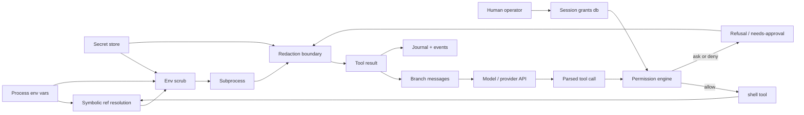

# The security model

Two layers, ported from dirge rather than reinvented: **secrets never enter
model space** (samizdat.security.secrets / redact), and **every shell command
faces a policy decision before it runs** (samizdat.security.policy). The
design rule underneath both: the model *references* secrets and capabilities
symbolically; only the kernel ever touches values.

## Content flow

Every edge below is "content flows to". The four properties under the diagram
are checked mechanically against this graph (chiasmus, Prolog reachability)
and the graph is the specification the e2e tests assert against.

Reading the load-bearing edges:

- **env reaches the subprocess only through scrub** (`env → scrub → sub`,
  `env → resolve → scrub → sub`): name-sensitive vars are stripped,
  value-shaped credentials replaced, before any spawn. There is no other
  edge out of `env`.
- **resolve feeds scrub, not the subprocess directly**: a `{{env/NAME}}`
  reference in tool args resolves at spawn time, and every value it resolves
  is added to the redaction known-values for that call — so even a
  subprocess that echoes the secret cannot get it past the boundary.
- **everything model-bound passes redact**: subprocess output, refusal text,
  everything lands in `result` only via `redact`, and `messages` and
  `journal` are fed only by `result`. The journal is model-visible on
  resume, so it is inside the boundary, not outside it.
- **no path from toolcall to sub skips perm or scrub**: the permission
  engine sits between every parsed call and the shell, and the scrub sits
  between the shell and the spawn.

## Properties (checked, not aspirational)

1. Every path from `env` or `secrets` to `model`, `messages`, or `journal`
   passes through `redact`.
2. Every path from `toolcall` to `sub` passes through both `perm` and
   `scrub`.
3. `resolve` (which holds resolved secret values) reaches nothing except
   through `scrub → sub`, and `sub`'s only outlet is `redact`.
4. `grants` are written only by `human` — the model has no edge into the
   grants table.

## The pieces, and where each came from

**Secrets and redaction** (dirge `src/sandbox/mod.rs`):

- `sensitive-env-name?` — name contains KEY/SECRET/TOKEN/PASSWORD/PASS/CRED/AUTH,
  minus the SAFE_EXACT list (PATH, HOME, SSH_AUTH_SOCK, GITHUB_TOKEN, …),
  plus the explicit cloud-credential names.
- `sensitive-env-value?` — high-confidence credential shapes only: URL
  userinfo (`scheme://user:pass@`) and the vendor-prefix set (`sk-`,
  `sk-ant-api`, `AKIA`, `ghp_`, `github_pat_`, `hf_`, `xox[bpras]-`,
  `xai-`, `AIza`). Long opaque base64 alone deliberately does not trip it.
- `scrub-env` — strip name-sensitive vars, collect their values, then
  replace any remaining var whose value is credential-shaped **or contains a
  known stripped value** with `[REDACTED]`.
- `redact` — URL-userinfo passwords and vendor-prefix tokens by regex, plus
  known secret values (config api-key, stripped env values, symbolically
  resolved values) by substring. Applied to every tool result before it
  reaches the branch messages or the journal.

**Shell permissions** (dirge `src/permission/`):

- Effects `allow | ask | deny` with most-restrictive-wins folding.
- Ordered rules, **last match wins**; command globs are shell-style (`*`
  matches any chars including `/`); a trailing ` *` makes args optional so
  `ls *` also matches bare `ls`.
- The curated base rule table: read-only inspection, project-scoped dev
  workflow, filesystem mutators, hard denies (`rm -rf /**`, `dd **`,
  `mkfs **`, …). Interpreters (`python`, `node`, `npx`), `git push`,
  destructive git, package installs, `sudo`, and `curl`/`wget` are
  deliberately absent: each asks.
- **Complex commands never ride an allow**: a command containing `$(…)`,
  backticks, `<(…)`, a subshell, or arithmetic expansion becomes a
  whole-command claim — `echo $(rm -rf ~)` cannot match `echo **`. Denies
  still apply to it.
- Allow rules match the command **raw** — `PATH=/tmp/evil git push` does not
  match a `git *` allow — while deny candidates additionally include the
  exec-prefix-stripped form so `nohup rm -rf /` still hits `rm -rf /**`.
- Session grants: an `ask` blocks with a needs-approval result; a human
  grant (`{:pattern "npx *"}`) persists in the db scoped to the run and is
  consulted before the base rules. Grants are a human-only write.
