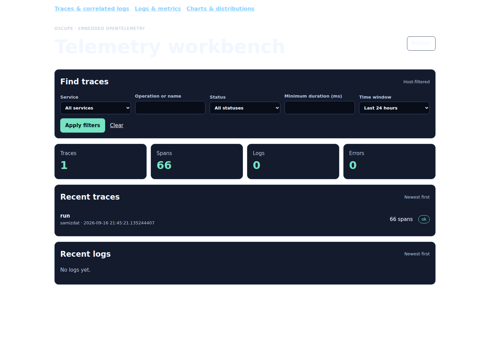
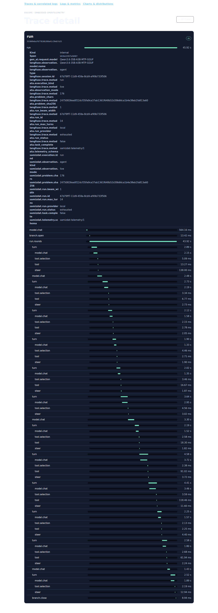
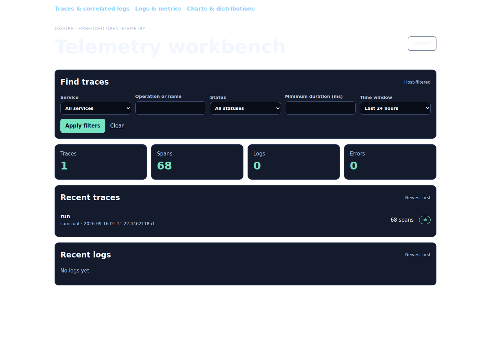
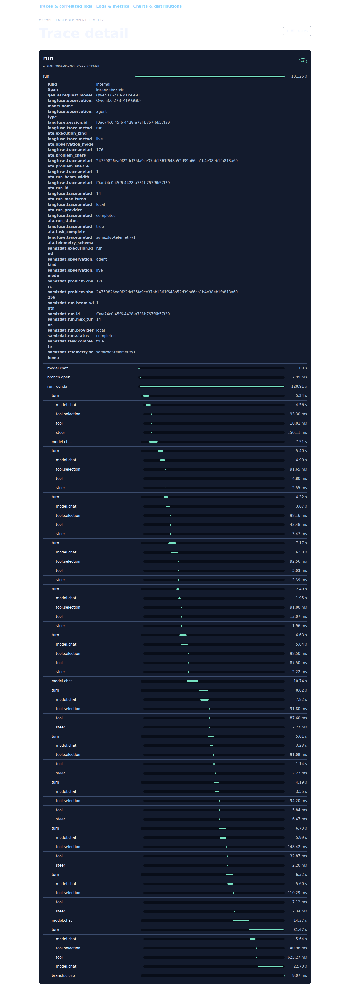
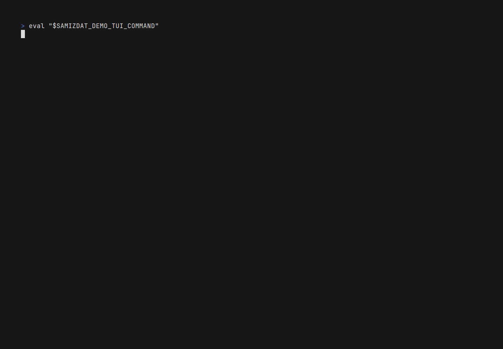

# Telemetry: the Samizdat OpenTelemetry contract

The embedded model demo opts its first server into run/turn completion counters,
actual elapsed operation durations (seconds), and fixed run lifecycle logs.
These borrow the embedded SDK owner; the harness and fresh reader create no
second SDK. Metric labels contain only operation kind and success/error, never
run IDs, prompts, tool payloads or exception messages. Ordinary logging is not
bridged. This producer slice is not yet proof of native ingestion, fresh-reader
metric/log readback or useful UI charts; those gates remain open.

The signal gate only qualifies a fresh, harness-owned Durable store, not a
historical shared store. The run observer requests a confirmed flush through
the existing embedded owner after recording its actual completion, and the
harness requires that fixed confirmation before reading. Each readback uses
a fresh process with a public read-only Durable snapshot and closes its reader
before exiting. Fixed native queries compare exact run/turn counts, finite
nonnegative measured duration sums and the two fixed logs correlated to the
current trace. The same values must survive process A closure and process B
reopen. Metric IDs are not labels. Native and real-model execution of these
new gates is still pending; earlier trace screenshots are not their proof.

Bounded observability for the harness (casselc/samizdat issue #21). This
document is the contract; the code is `samizdat.telemetry.*`.

**This tree integrates upstream main `83eb99a4f6d01923ddee199d453d960a45dd732b`
with the fork's telemetry and task-ownership fixes**: the contract, the hook,
the nine harness run seams, the `:telemetry` alias and the `serve` entry,
early ownership, cancellation cleanup, and persisted branch ceilings. The five
`samizdat.store.lifecycle` seams of the pilot lineage
(`agent/onbox/observability-v1`) do not exist upstream and are not here.
The re-anchor keeps current main's acceptance behavior and its three workflow
outcomes: a delivered answer records `:shipped`, ordinary non-completion
records `:failed`, and a thrown run records `:error` before it is rethrown.

## What it is, in one paragraph

A **versioned attribute manifest**
(`resources/samizdat/telemetry/attribute-manifest.edn`, schema
`samizdat-telemetry/1`) says how every telemetry fact is spelled, typed, who
is entitled to state it, whether it is one of the few **promoted typed
columns**, and how it is mirrored for Langfuse. A dependency-free
**contract** namespace loads and validates it and renders it as canonical
JSON for other consumers. A dependency-free, inert **hook** seam sits at the
nine harness run seams (below). Under the optional `:telemetry`
alias, `samizdat.telemetry.otel` wraps casselc/otel with semantic helpers,
installs the hook observer and exports through independently bounded
pipelines to a local receiver, Langfuse, or both.

Telemetry is a **view, not a source of truth**. The journal and the pilot
evidence records decide budgets, action legality, completion and what was
known at decision time; every attribute carries an `:authority` naming whose
fact it is, and `samizdat.value.basis` (`measured` / `reconstructed` /
`unavailable`) says how the value was obtained. Worker claim, protocol
verdict, infrastructure status and task completion are four attributes, never
one.

## Modes and behaviour statement (platform profile)

| build | what loads | behaviour |
|---|---|---|
| **source mode** (stock `jolt -M:test`, `jolt serve`, Jolt ≥ 0.8.0) | `samizdat.telemetry.contract`, `samizdat.telemetry.hook` (both `src/`, no new dependency) | `hook/observe!` calls the thunk directly; the seam functions behave exactly as before (`test/samizdat/telemetry/hook_test.clj`; the stock suite is the equivalence check). No otel namespace exists on the path. |
| **alias-enabled** (`jolt -M:telemetry …`, current qualification lane Jolt 0.8.6) | additionally `telemetry/samizdat/telemetry/otel.clj` and casselc/otel `4d61f8e` (see the exact pin in `deps.edn`) | `otel/init!` reads `SAMIZDAT_TELEMETRY` and installs the observer; one span per run seam, semantic wrappers for executions, generations, tools and evaluators. |
| **woven** (aspect pack `resources/META-INF/jolt/aspects/samizdat-observability-run-83eb99a.edn`, the nine harness seams verified against upstream main `83eb99a`) | `samizdat.telemetry.aspect-provider` role `:samizdat.telemetry/run` at the same entries | Statically validated against this tree (`test/samizdat/telemetry/aspect_manifest_test.clj`: each entry resolves once at the stated arity). Not qualified as a build here — see the bootstrap work product report. |

Optional aspect behaviour never becomes a runtime dependency: the stock
build does not require `otel.*`, and the hook is a no-op until something
installs an observer.

`SAMIZDAT_TELEMETRY`:

| value | destinations |
|---|---|
| unset / `off` | nothing installed; wrappers use the API no-op tracer |
| `local` | OTLP/HTTP JSON to `SAMIZDAT_OTEL_LOCAL_ENDPOINT` (default `http://127.0.0.1:4318`, standalone oscope) |
| `langfuse` | OTLP/HTTP to `LANGFUSE_HOST` + `/api/public/otel/v1/traces` |
| `dual` | both, each on its own bounded queue and worker (`otel.sdk.export/independent-batch-pipelines`) |

Langfuse credentials are never read from the command line or stored: the
Jolt side reads one environment variable **named** by
`SAMIZDAT_LANGFUSE_OTLP_HEADERS_ENV` (default `SAMIZDAT_LANGFUSE_OTLP_HEADERS`)
whose value is in `OTEL_EXPORTER_OTLP_HEADERS` syntax, e.g.
`Authorization=Basic <base64(pk:sk)>,x-langfuse-ingestion-version=4`. The
value is handed to the Langfuse exporter and nowhere else; diagnostics
(`otel/stats`, flush and shutdown results) are scalar counts by design.

A `TRACEPARENT` (and `TRACESTATE`) environment variable parents the process's
spans under the caller (`otel/with-inbound-context`), which is how a
`lifecycle_cli` run lands under the Python execution span.

## Harness run seams (M2)

The same fail-open hook wraps the agent loop, so a `jolt serve` run produces
one trace per `POST /v1/runs` when the alias is active. Hook kinds, the seam
each wraps, and the span it becomes:

| hook kind | seam | span / Langfuse type | facts at start → end |
|---|---|---|---|
| `:run` | `samizdat.agent.beam/run!` | `run` / agent (trace root) | provider, model, `samizdat.problem.sha256`/`chars`, max_turns, beam_width → `samizdat.run.id`, `.run.status`, `.task.complete` |
| `:control-loop` | `beam/run-rounds` | `run.rounds` / span | run id, start turn, branch count |
| `:branch-open` / `:branch-close` | `samizdat.store.runs/open-branch!`, `close-branch!` | `branch.open`, `branch.close` / span | run, branch, parent, created-at turn → status |
| `:turn` | `beam/advance-branch` | `turn` / span | run, branch, `samizdat.turn` |
| `:model` | `samizdat.llm.client/chat` (arity 4) | `model.chat` / generation | provider, `gen_ai.request.model`, message count, max_tokens, prefill?, force_tool? → `gen_ai.response.finish_reason`, elapsed ms, content chars, `gen_ai.usage.{input,output,total,cache_hit}_tokens` |
| `:tool-selection` | `samizdat.agent.infer/absorb` (arity 3) | `tool.selection` / span | turn, response chars → parsed tool, parsed?, said chars |
| `:tool` | `samizdat.agent.tools/run-tool` | `tool` / tool | branch, `samizdat.tool.name` → category, progress, output chars |
| `:steer` | `samizdat.agent.arbiter/decide` | `steer` / span | branch, turn → gate, priority, passed-over count |

By default the problem text, prompts, messages, tool arguments, tool output
and model content never become attributes; only their digests and sizes do
(`docs/DATA-GOVERNANCE.md`; mapping/2 carries content in synthetic mode
only). Every run span carries `samizdat.execution.kind = "run"` and
`samizdat.observation.mode = "live"`; the run id is mirrored to
`langfuse.trace.metadata.run_id` and used as the session id. The aspect form
of the seam list is
`resources/META-INF/jolt/aspects/samizdat-observability-run-83eb99a.edn`.

### Content override (prompts and outputs on live spans)

`SAMIZDAT_TELEMETRY_CONTENT=on` (the literal `on`; anything else is off)
opens the content policy for **live** spans, and only those — a historical
import refuses content whatever the override says, and synthetic mode never
needed it. It is read once by `otel/init!`, so a running server does not
change policy mid-run. With it on, every harness seam carries an input and
an output under the Langfuse observation keys, beside (never instead of) the
digests and counts. Strings travel verbatim; structures travel as JSON
(`otel/run-content-in`, `otel/run-content-out`):

| seam | `langfuse.observation.input` | `langfuse.observation.output` |
|---|---|---|
| `run` (root; Langfuse v4 shows it as the trace's input/output) | the problem | the answer |
| `branch.open` | `{branch-id parent-id created-at-turn problem}` | `{branch-id}` |
| `run.rounds` | `{start-turn branches}` — one summary per branch (id, status, reason, turn/message counts, gate counters, phase) | `{status answer branches}`, the same summaries as the rounds left them |
| `turn` | the branch summary plus `turn` and `last-message`, the tape entry the turn starts from | the branch summary plus `appended`: only the messages this turn added (the model's reply, the tool's result) — never the whole tape |
| `model.chat` | the wire messages, as JSON (after `message/prepare`, i.e. exactly what the provider received) | the model's content |
| `tool.selection` | `{content prefill}`, the reply the parser read | `{parsed signals}`, the call it found (`name`, `args`) and the mechanics signals |
| `tool` | the model's arguments, recursively scrubbed through the run's known-value redaction set, as JSON | the result the branch reads |
| `steer` | the branch summary plus `turn` (what the gates read) | the realised decision — `gate priority message prediction tool window passed-over` (a gate's `effect` fn is dropped) — with `"steered":true`, or `{"steered":false}` when no gate fired |
| `branch.close` | `{branch-id status reason}` | `{rows closed}` |

What travels is only text the model already saw or produced and the
harness's own decisions about it: messages after the RFC-003 redaction, tool
arguments and results after the canonical known-value redaction boundary, the
model's content, steer messages, branch
reasons. No environment value, endpoint or credential has a path onto a span
through this override. The seams hand the hook references (the branch map,
the branch list, the response), and none of it is read unless the override
is on — a telemetry-enabled build without it does the same work as before.

Each value is clipped to `SAMIZDAT_TELEMETRY_CONTENT_MAX_CHARS` characters
(default 32768; a clipped span carries `samizdat.content.truncated = true`,
and the `*_chars`/`sha256` facts always describe the full value). The
resource of every span states the policy the process ran under,
`samizdat.telemetry.content = "off" | "on"`, so a trace without prompts is
distinguishable from one that refused them. With the override on the export
batch is capped at 8 spans (an explicit `:batch` wins) so one request stays
under the local receiver's 1 MiB limit, and `init!` logs one WARN line naming
the destinations the text goes to. Programmatic use: `(otel/init! {:content
{:enabled? true :max-chars n}})`.

`samizdat.telemetry.serve` is the alias-enabled server entry point:
`jolt -M:telemetry -m samizdat.telemetry.serve` initialises telemetry from
the environment, registers `otel/shutdown!` as a shutdown hook and then
delegates to `samizdat.core/-main`. `HARNESS_*` variables configure the
harness exactly as for `jolt serve`.

### Embedded local-only server

The explicit embedded launcher keeps Oscope, its in-process chDB exporter,
and Durable storage in the Samizdat process. It opens no telemetry listener,
does not select standalone OTLP or Langfuse, and never reads Langfuse endpoint
or credential variables. Telemetry content is off and cannot be enabled by
the standalone mode's environment variables.

The alias enters through a host-only bootstrap. It arms Jolt's centralized
INT/HUP/TERM shutdown owner before dynamically loading Oscope or chDB, so
native worker threads cannot take a process signal away from the shutdown
hook. A signal during construction prevents application ingress and waits at
most 120 seconds for the embedded cleanup capability to publish or startup to
fail.

```sh
JOLT_CHDB_LIB=/path/to/libchdb.so \
  jolt -M:telemetry:embedded-telemetry:embedded-serve -- \
  --durable-root /path/to/non-secret/telemetry-store
```

`SAMIZDAT_EMBEDDED_DURABLE_ROOT` is the file-safe fallback when the flag is
omitted. The flag takes precedence. Paths are required and are never retained
in configuration errors or shutdown diagnostics. `HARNESS_*` continues to
configure the ordinary server and model runtime.

Application ingress and resources stop before the embedded owner drains its
SDK, closes the Oscope source, checkpoints Durable, and closes the connection.
Run ownership covers task teardown, not only the Durable status transition:
shutdown cancels rows that are still running, then boundedly awaits every
snapshotted task's canonical completion. Already-terminal rows such as
`exhausted` are not cancelled while their outer `run` and `run.rounds` scopes
unwind. This ordering ensures those root spans are ended and handed to the SDK
before application stop lets the embedded owner flush and close it. A missing
or non-terminating owner produces one bounded, identity-free shutdown failure;
resource cleanup remains best effort after that bound.
Synchronous OpenAI-compatible agent runs use the same guarded exceptional
closure as background runs: a live row becomes `failed` (or `aborted` for
cancellation), while an existing terminal result remains unchanged. Durable
cleanup failure never replaces the original synchronous task exception, and
the active owner still publishes completion and is removed.
The same listener now serves the borrowed read-only Oscope UI at `/oscope`:
charts and distributions at `/oscope`, the trace/correlated-log workbench at
`/oscope/telemetry`, and logs/metrics at `/oscope/events`. Only the exact mount
and slash-delimited children belong to Oscope; a path such as `/oscopes` still
belongs to Samizdat. Requests must carry the exact `127.0.0.1:<HARNESS_PORT>`
Host authority or receive Oscope's `421 misdirected request` response.

This mount starts no second listener and exposes no OTLP receiver. Viewer
queries run with instrumentation suppressed so reading telemetry cannot create
recursive telemetry. Admission is bounded; overload and closing return 503.
Shutdown records interrupted work, stops Samizdat ingress/resources, rejects
new viewer requests and drains admitted requests, and only then retires the
Oscope source and Durable owner. Failure to confirm the bounded viewer drain
leaves the source open and fails shutdown rather than closing storage beneath
an active query. The first borrowed surface intentionally omits the plot editor
and strips Oscope's binary-export command until Samizdat has explicit adapter
semantics for them.

The production chDB adapter owns one native storage lifetime per process. A
recovery check therefore starts a fresh Jolt process only after the writer
process reports `:closed`, opens the same Durable root there, verifies the
persisted span through both the source command and `/oscope/telemetry`, drains
the viewer, and closes that second owner before it exits.
An application-stop exception does not skip that embedded retirement: when the
embedded owner closes, the original application exception remains primary; if
both fail, the bounded Durable-close failure is primary and records only that
application stop also failed, never its exception, message, data, path, or
cause. Lifecycle logging is observational and fail-open: a logging backend or
rendering failure cannot skip cleanup or replace its terminal result.
Retryable `:closing` or thrown stop attempts are retried at 25 ms intervals,
at most 100 attempts. Exhaustion logs a bounded status/phase and exits with a
failure instead of spinning or claiming a close that Durable did not confirm;
normal, signal, and `finally` cleanup faces share that first terminal result or
failure, so they neither redrive the bound nor duplicate its diagnostic. A
concurrent cleanup face waits at most 120 seconds for that terminal outcome and
fails explicitly if the owner remains stuck. The launcher does not call
`System/exit`, but leaves the bounded failure uncaught for Jolt's normal nonzero
termination. If embedded attachment fails after acquiring Oscope, its narrow
retry capability is published to the same shutdown owner and driven through
this bound before the startup error escapes.
The stock `jolt serve` and standalone `off`/`local`/`langfuse`/`dual` launcher
are unchanged.

### Reproducible steered model demo

`fixtures/embedded-model/calc-v1` is a versioned, deliberately failing project:
`square` multiplies by 2 and its one test fails. The historical baseline named
in its provenance, `b15ba4e125c7a57a924e16df403b9a2ddebff816`, is unavailable
both locally and from this repository's remote. The demo therefore copies the
fixture into a scratch directory and creates a new deterministic Git commit. It
records both identifiers and refuses to claim that the new commit is the lost
object.

The cost-bearing run is explicit and is never invoked by a test. Only with
authorization to contact the configured model endpoint, run:

```sh
scripts/embedded-model-demo.sh
```

Defaults are the Lemonade-compatible endpoint
`http://marvin.asymptote-city.ts.net:13305/v1`, model
`Qwen3.6-27B-MTP-GGUF`, the selected `aea91781` Jolt binary, chDB 26.7.3, and
a 30-minute overall deadline. Override them with
`SAMIZDAT_DEMO_BASE_URL`, `SAMIZDAT_DEMO_MODEL`, `SAMIZDAT_DEMO_JOLT`,
`SAMIZDAT_DEMO_EXPECTED_JOLT_REV`, `SAMIZDAT_DEMO_WRAPPER`, `SAMIZDAT_DEMO_CHDB_LIB`,
`SAMIZDAT_DEMO_TIMEOUT_MS`, or `SAMIZDAT_DEMO_OUTPUT`. The expected revision
defaults to the reviewed `aea91781` substring and must occur exactly in the
selected binary's `--version` output; a diagnostic binary can name its own
revision (for example `a7d07660`) without weakening that check.

Before creating the project fixture, opening ports or acquiring a collector, the demo
defaults to `--model-preflight lemonade-loaded`. It reads Lemonade's `/health`
metadata and requires the exact requested model in `all_models_loaded`;
a `/models` registry listing or the most-recent `model_loaded` field is not
enough. It never loads, unloads or chooses a replacement model. Generic
OpenAI-compatible endpoints without this health contract must explicitly pass
`--model-preflight none`; this skips readiness verification, not provider errors.
New success evidence records the selected mode and a metadata-readiness flag.
Loaded metadata is not proof that a later inference request will succeed.

The GET sends no authentication headers and follows no redirects; preflight
URLs with user information, query parameters or fragments are rejected. Failures
expose only fixed reasons and HTTP status, not server bodies or exceptions.
The demo uses `/usr/bin/curl` 8.5 or newer for this check only. Private transport
scratch files are acquired before the project or collector. Version checking,
setup and the entire request share a monotonic deadline of at most 10 seconds,
also limited by the overall harness budget. Connect time is at most 3 seconds;
curl stops received response bodies above 65,536 bytes, including responses
without a declared length. No decompression, proxy, curl configuration files,
authentication or redirect following is enabled. A timed-out direct child has
a separate bounded retirement allowance of up to 4 seconds. If terminal state
cannot be confirmed, the check fails closed before collector acquisition and
preserves private scratch rather than deleting files a child may still write.
The JSON parser also retains its 65,536-character validation guard.
After each server's final cleanup, the harness attempts to write
`server-a-retirement.json` or `server-b-retirement.json`, including when a task
fails before verification. These contain measured exit, terminal/closed/graceful
flags, close-announcement count and log-publication status—not raw errors, PIDs,
launch commands or telemetry values. Missing exit observations stay `null`;
unknown retirement does not allow process B or deletion of original logs.
Filesystem publication can fail, so the existence of a complete receipt is
evidence, not an unconditional promise. Cleanup publication never replaces the
original task failure. Successful evidence also includes these retirement
scalars; historical sample files without them remain unchanged.
Run the loopback-only transport regression without model calls:

```bash
python3 scripts/test-preflight-transport.py --jolt /path/to/selected/jolt \
  --wrapper /home/chuck/ai-src/tools/jolt-with-chez-10.4.1
```

It checks exact body-byte boundaries, unknown-length and chunked responses,
UTF-8 bytes versus characters, partial headers, slow bodies and no redirects.
The cap applies to response bodies, not HTTP headers or bytes outside a message
whose declared Content-Length is smaller. Private scratch deletion is attempted
only after confirmed exit; filesystem cleanup failures do not erase the cause.

The harness starts Samizdat with a complete environment allowlist: no Langfuse,
OTLP, or provider credentials are inherited. It submits one run at 14 turns,
120,000 tokens, beam width 1, and a hard total-branch cap of 1. After the first
durable `turn` event it submits the cube requirement exactly once. Success
accepts terminal `completed` or `exhausted`, then independently requires
`jolt -M:test` reporting exactly 6 tests, 6 assertions, 0 failures, and 0 errors.
Because the model can edit those tests, that summary is not a trusted semantic
oracle. A separate fresh `jolt -Srepro -e` process runs a fixed, host-owned
expression calling square on 0, 3, -4 and cube on 0, 3, -2. Its complete output
must be `[0 9 16 0 27 -8]`, with a successful exit and no stderr, before telemetry
qualification or process B starts. Success evidence records
`trusted-semantic-check: true` and `semantic-case-count: 6` separately from the
six-test counts. This checks those six cases, not all possible inputs, and
does not defend against deliberately hostile runtime or dependency changes.
Both Jolt's concise summary and the JVM-style summary are recognized; extra
summaries, changed counts, failures, errors, timeout, or nonzero exit fail closed.
Tool-call parsing also recognizes the observed hybrid wrapper: a response
consisting only of a documented tool-call fence opener, complete call JSON,
and orphan `</parameter>` then `</invoke>` closing tags. It requires a nonempty
tool name and an argument object, rejects extra JSON or trailing prose, and
marks the wrapper as repaired. This repairs formatting, not authority: the
normal tool registry and permission checks still decide whether it can run.
An exhausted orchestration remains exhausted in evidence; passing fixture and
telemetry gates does not relabel it completed.

For runtime diagnostics only, `JOLT_FIBER_TRACE_LIMIT` is passed to server A
and B when present and must be a canonical integer from 1 through 4096. It is
absent by default and is never added to toolchain, fixture, Git, or verification
children.

Telemetry qualification uses only the supported mounted UI. It discovers the
run trace from `/oscope/telemetry?window=1h`, reads
`/oscope/telemetry/traces/<trace-id>`, and requires `samizdat.run.id` plus all
nine families: `run`, `run.rounds`, `branch.open`, `branch.close`, `turn`,
`model.chat`, `tool.selection`, `tool`, and `steer`. Content attribute keys must
be absent. Process A must close after TERM before process B starts against the
same Durable root; B performs no model call, must recover the same run trace
through the UI, and must also close cleanly. Each close requires exactly one
confirmed `{:status :closed, :phase :closed}` diagnostic and TERM exit 143.

Each run writes bounded, redacted server-log tails and `evidence.json` below
`target/embedded-model-demo/<session-id>`. Evidence contains configuration
bounds, IDs, counts, and pass/fail facts, not prompts, model replies, HTTP
authorization, or credentials. These files are the input for later VHS or
Playwright capture; the presentation tools do not need to repeat the model run.
After qualification, reopen the same local database and Durable root with an
independently owned local reader. `scripts/embedded-model-capture.cjs` takes
the loopback base URL, `evidence.json`, a fresh screenshot directory, and the
root of an existing Playwright installation. It only permits same-origin GET
requests and refuses credential/content markers before saving the trace and
index screenshots. It does not save HTTP bodies or browser traces.

`scripts/embedded-model-tui.tape` captures the actual HTTP-client TUI with VHS.
Set `SAMIZDAT_DEMO_TUI_COMMAND` to the selected Jolt command with a local
`ftxui-jolt` dependency and that reader's loopback URL, then invoke VHS from a
fresh capture directory. It never submits, resumes, or steers a run. The TUI
can show the public fixture's task and code; unlike the telemetry view, it is
not a content-off surface. Do not use this tape against private sessions.

The 30-minute limit remains the cost bound for legitimate long responses. A
structural `jolt-fiber-run` state failure is different: it can kill a task
without changing a run row that already says `running`. The demo recognizes
that exact bounded-log marker, aborts the row on its next one-second poll, and
fails without waiting out the remaining model budget. Samizdat also records an
ordinary exceptional run-task exit as `run-error` and closes its row `failed`.

### Current local Durable sample (2026-09-16)

The [current harness evidence](examples/embedded-model-live-2026-09-16.json)
comes from published checkpoint `ba7f35a65b3273b5241a9286f9b0926e72e4cbaf`,
using the already-loaded `Qwen3.6-35B-A3B-MTP-GGUF` model. The application
exhausted its token budget after 12 turns and one scripted steering request;
it did not report completion. Separately, all six tests and six fixed
host-owned arithmetic checks passed. Process A showed all nine content-off
span families, closed before B opened the same Durable data, and B recovered
the same trace without a model call and closed gracefully.

These fresh screenshots came from another owned viewer process, C, reopened
on that retained data. Capture used loopback GET requests only; its inference
endpoint was deliberately disabled. C's retained shutdown receipt confirms
exit 143, one closed announcement, and terminal state; no owned process remained.
No new model run was needed for these images.





The captured index reports zero logs, and the selected metrics view is empty.
The Samizdat emitter used here emits spans, not metric instruments or OTel
log records. Its
[empty metrics view](images/embedded-model/2026-09-16/oscope-metrics.png)
records that coverage gap; it is not a metrics demo. Langfuse-named attributes
are compatibility metadata here, not evidence of remote export: this run was
purely local, with content and external export disabled.

This qualifies the selected SDK `4d61f8e`, exporter `14a2998`, Oscope `7ee3ec4`,
chDB binding `95d7b2b`, native chDB 26.7.3 and Jolt `aea91781` graph. It does
not qualify newer pins, typed-schema consumption, Langfuse interoperability,
every UI feature, or the full hosted release. The 120,000-token budget is
checked after inference calls; exhausted task state is retained truthfully.
No orphan-wrapper repair fired in this sample, so it is not live
proof that the parser compatibility fix caused success. The current evidence
records A's required close-before-reopen result, not its numeric exit; the
exact C exit above is a separate capture receipt.

### Historical recovery snapshot

One real run completed after 12 turns, with the cube request applied at turn 2.
Its independent fixture command passed six tests and six assertions. The first
harness invocation still failed: its parser expected JVM wording rather than
Jolt's concise test summary. That parser now has strict tests for both formats.
No model run was repeated to repair the evidence.

A fresh process reopened the same Durable root and recovered all nine
content-off span families. It closed exactly once with confirmed closed state
and exit 143. The original process's close was confirmed, but its signal exit
and live trace query were not retained; those observations are explicitly
unavailable in the [historical recovery summary](examples/embedded-model-recovery.json).
This summary was hand-assembled from recovered observations; it is not output
from the current harness's `evidence-record` success path. It does not qualify
the current integration end to end, nor claim that the first harness invocation
passed end to end. Its `evidence-kind` and `current-harness-output` fields make
that distinction explicit; the unavailable process-A observations remain
unavailable rather than being reconstructed as successful gates.

These are actual Playwright captures of a later read-only reopen, not mocked
screens or pages repaired with injected CSS. The index shows one trace and 68
spans; the detail shows the run, rounds, model, tool, and steering timings.
No Langfuse destination was configured, and content attributes are absent.





The actual Samizdat TUI also opens this completed session through the local
reader. This recording only views the existing run; it does not submit a new
model request. Its task, code, and tool output belong to the public fixture,
so the TUI recording is not a demonstration of content-off telemetry.



[Full-resolution TUI screenshot](images/embedded-model/samizdat-local-demo.png)
and [WebM recording](images/embedded-model/samizdat-local-demo.webm).

The pale heading on a white outer canvas and wrapped long attribute labels
are existing readability defects tracked in
[Oscope #106](https://github.com/chucklehead-dev/oscope/issues/106).

Runtime provenance for this example: Jolt `v0.8.6-13-gaea91781`, source
`aea91781bbab68bf174fef4a689bb00dcf834ded`, binary SHA-256
`7adde574ec02b1297cf3af792ba525f19ffa44be167093d07e54d4345fbe490b`;
chDB 26.7.3, library SHA-256
`36ad4e999882821ef13cf2d0f52c93f48e6ee1b4498b35a201c23ce4b8d15bf5`;
Playwright 1.61.1 with cached Chromium 149.0.7827.55, revision 1228.

## Dependencies under the alias

Only the alias adds dependencies; the stock `:deps` are unchanged.

| lib | revision | why |
|---|---|---|
| Oscope embedded profile | `7ee3ec4f6aaa4d085d88384f85934280d421fa1a` | reviewed in-process owner and UI handler sources, without the standalone server profile |
| casselc/otel | `4d61f8e921d1310bc7ba39d7208cc38ac14a3215` | reviewed SDK revision shared by Samizdat and Oscope |
| jolt-chdb | `95d7b2b31c95e007d5065e3950deb1869e2d0f8a` | current reviewed Durable/native lifecycle revision |
| jolt-otel-clickhouse | `14a2998a27f64a9bff329811461be9157a00c849` | embedded chDB exporter selected by Oscope |
| casselc/jolt-http | `35d1d7f9ebdc796ee9bd4c80745298b2c8b7fdf8` | viewer-only Ring dependency; the handlers use Samizdat's existing listener |
| jolt-otel-viewer | `5723a7c28c3bb3ae7cb27f9856b90463e77df523` | trace workbench rendering used by Oscope's handlers |
| jolt-lang/http-client → casselc/http-client | `eab6b78d5957f88690faf6768360572a3f185341` | the exact revision selected by otel; the otel edge uses a second lib id for the same `jolt.http.*` namespaces, so the alias excludes that edge and selects this source once under Samizdat's stock coordinate |
| jolt-lang/db → casselc/db | `96324713500c96ae97c0deaf84691f31df158f25` | one database namespace provider shared by Samizdat and Durable |
| org.clojure/data.json → casselc/data.json | `3174868a7baa06e118fb8d1201edd98c5769b335` | one JSON implementation across the embedded graph |
| jolt-lang/jolt-crypto | `5effcc89a3258499a79a2a3d69edad9e7800d1bf` | one canonical crypto provider across chDB, viewer, OTel, and HTTP |

`jolt -Stree -A:telemetry:embedded-telemetry` and
`jolt -Spath -A:telemetry:embedded-telemetry` show one provider for the
database, HTTP client, HTTP server, OTel SDK, exporter, and viewer namespaces.
The embedded launcher composes only the low-level UI handlers. It does not load
`oscope.server`, `oscope.otlp`, `oscope.embedded.viewer`, or the visualization
editor, and it does not start another listener.

## The manifest

Each attribute: `:key`, `:type` (`:string | :boolean | :int64 | :double`),
optional closed `:domain`, `:group`, `:authority`
(`:journal | :evidence | :runtime | :import | :telemetry`), `:promote?`,
`:langfuse` (`:trace-metadata | :observation-metadata | :usage | :session |
:type | :model | :none`) and `:missing` (`:unavailable | :not-applicable`).

Groups: identity, evaluator, outcome, feedback, usage, budget, cost,
trigger, lifecycle, provenance, version, kind. Budgets are signed int64
(`samizdat.budget.<dim>.{granted,used,remaining}`, wall in ms); costs are
doubles with separate scopes (`worker`, `operational-action`, `research`) and
the reconciled labels `wall_elapsed_s` / `wall_charged_s` / `wall_credited_s`.

**Promoted set** (14, string/boolean/int64 only, `:max-promoted 16`):
`samizdat.execution.kind`, `.evaluator.id`, `.evaluator.status`,
`.evaluator.purpose`, `.worker.claimed`, `.protocol.correct`, `.infra.error`,
`.task.complete`, `.feedback.delivered`, `.budget.turns.remaining`,
`.budget.wall.remaining_ms`, `gen_ai.usage.output_tokens`,
`.observation.mode`, `.value.basis`. Everything else stays in the untyped
attribute map. Historical feature columns are not promoted.

`contract/normalize` keeps `false`, `0`, negatives and `""`; omits `nil`;
coerces declared keys to their type; and moves anything undeclared or
ill-typed to a string under `samizdat.x.<key>` while reporting it
(`normalize-result` → `:errors`). Nothing is silently dropped and nothing
undeclared can pose as a contract attribute.

The Langfuse mirror (`contract/langfuse-mapping`) is generated from the
manifest, never hand-written: `langfuse.observation.type` from
`samizdat.observation.kind` (`agent | generation | tool | evaluator | span`),
`langfuse.session.id` from `samizdat.family.id` else `samizdat.run.id`,
`langfuse.trace.metadata.<key>` / `langfuse.observation.metadata.<key>` for
the targeted attributes, `gen_ai.usage.*` native, and
`langfuse.observation.level=ERROR` only for infrastructure errors. Failed
verdicts are verdicts; there are no Langfuse scores.

Mapping version `samizdat-langfuse-mapping/2` adds two rules, both learned
from live readback of `/1`:

- **Trace metadata is root-scoped.** Langfuse keeps one `metadata` map per
  trace and applies every span's `langfuse.trace.metadata.*` to it, last
  writer wins. Under `/1` two `evaluator` children carrying different
  `samizdat.cost.action_charged_s` values raced for one trace slot. Under
  `/2` only the root observation kind (`agent`, `:root-observation-kind`)
  mirrors a trace-targeted attribute to `langfuse.trace.metadata.<key>`;
  every other kind mirrors the same attribute to
  `langfuse.observation.metadata.<key>` (`:trace-metadata-on-observation`).
  The canonical `samizdat.*` key is present on every span regardless.
  `set-facts!` reads the kind from the span it is given.
- **Observation content is synthetic-only.** `langfuse.observation.input` and
  `langfuse.observation.output` (`:content-keys`) travel only when
  `samizdat.observation.mode` (`:mode-source`) is `synthetic`
  (`:content-allowed-modes`). Live and historical-import spans never carry
  prompts, tool arguments, file contents or delivered text
  (`docs/DATA-GOVERNANCE.md`); a content key offered in any other mode, or
  with no mode, is dropped before normalisation (so it can never be
  stringified into the `samizdat.x.*` fallback) and the key *names* are
  recorded under `samizdat.x.content.refused`. Synthetic qualification uses
  stub content to exercise the input/output path end to end.

## Rendering for consumers

```
jolt telemetry-manifest OUT-DIR
```

writes `attribute-manifest.json`, `langfuse-mapping.json` and
`typed-columns.json` as canonical JSON (sorted keys, no insignificant
whitespace, byte-stable), suitable for pinning by sha256 beside the samizdat
commit that produced them.

## Tests

- stock: `jolt -M:test` (CI pins Jolt 0.8.6) includes
  `samizdat.telemetry.{contract,hook,aspect-manifest}-test`;
- alias: `jolt telemetry-test` = `jolt -M:telemetry:telemetry-test`
  (current local qualification uses the Jolt 0.8.6 AEA lane; older releases
  are not requalified by this update) adds `samizdat.telemetry.{otel,pipelines}-test`: typed
  attributes incl. false/0/negatives, the Langfuse mirror, observer failure
  isolation, suppression, TRACEPARENT
  parenting, a throwing destination beside a healthy one, bounded queue
  overflow with per-destination drop counts, bounded exactly-once shutdown,
  and that exporter errors never reach diagnostics, plus the nine M2 run
  seams driven through the hook (one trace, run → rounds → turn → model.chat
  parentage, Langfuse types, usage keys, absent facts stay absent), and the
  content override (off by default: the seams' text never travels and no
  refusal marker appears; on: the three seams' input/output, clipping with
  its marker, the resource marker, historical-import still refused).
